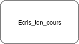

# Exercice 2 : Différence Fonctions et procédures

## Introduction 

Ici nous allons parler de fonctions, procédures, arguments etc.

Vous avez dû rencontrer ce genre d'image dans votre cours. Les flèches qui rentre dans la boîte sont les arguments. Et ceux qui sortent c'est les résultats, s'il y en a.

Dans l'exemple ci-dessus, vu dans vos TPs, on a deux arguments (`Cap_Actuel` et `Cap_Voulu`), on passe ces deux arguments à notre "boîte" qui nous renvoit un float.

## Procedure & Fonctions

Nous allons maintenant parler du coeur de vos difficultés au premier semestre : la différence entre fonctions et procédures.

En gros, notez bien ceci : si vous devez renvoyer quelque chose c'est une fonction sinon c'est une procédure.

Exemple simple, si je demande à un camarade de me ramener un café, étant donné qu'il me rapporte un café c'est une fonction. Pour se ramener à l'exemple du dessus, `Delta_Cap` est bien une fonction. 

Parlons maintenant des procédures. Une prodécure c'est juste une liste d'action qui ne renvoit rien. Par exemple, si je vous demande d'écrire dans votre cahier, c'est une procédure. En effet, je vous demande pas de me donner quelque chose.

